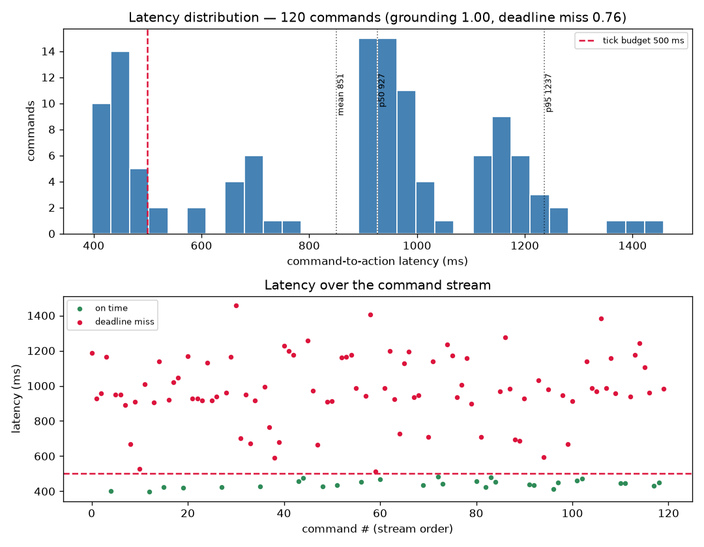
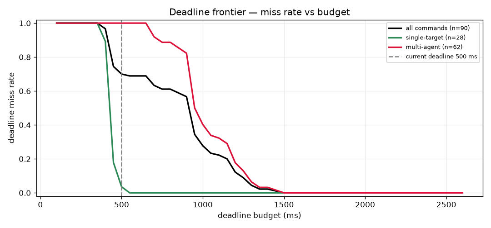
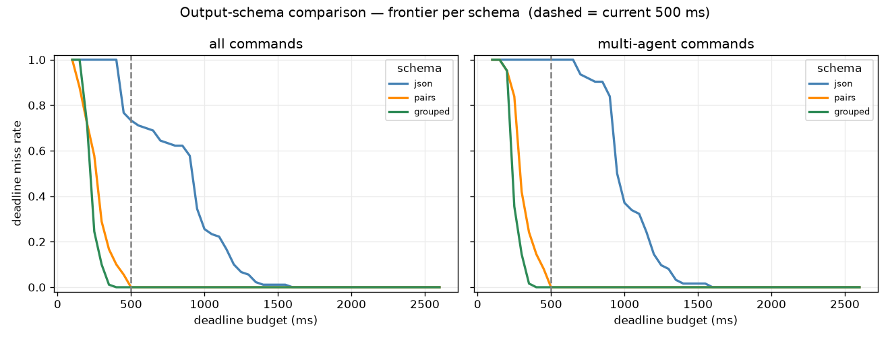
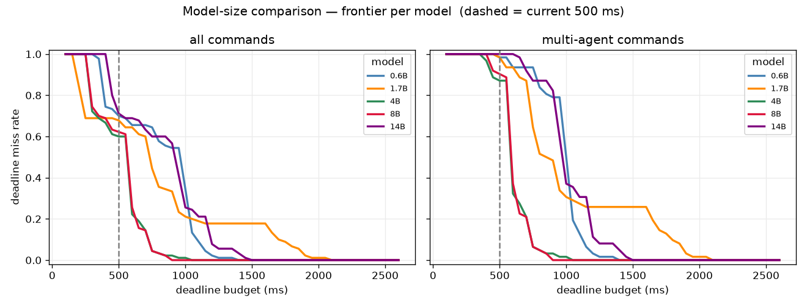

# World Commander Bench — Run Report

**Date:** 2026-06-19
**Machine:** amax41 (3× RTX 2080 Ti)
**Served model:** `Qwen/Qwen3-14B-AWQ` via vLLM (OpenAI-compatible, `localhost:8000/v1`)
**vLLM config:** TP=2 (GPU 0+1), AWQ, `--enforce-eager`, `max_model_len 16384`, `dtype half`
**Note:** the same vLLM instance also serves the Lab Inventory Bot, so the GPU is *shared* — latency carries contention noise.

## Endpoint confirmation
```
$ curl localhost:8000/v1/models
→ id: "Qwen/Qwen3-14B-AWQ", max_model_len: 16384
```
Matches the `.env.example` default; `.env` written accordingly.

## Results

| Run | Commands | Grounding | Deadline-miss | Latency mean | p50 | p95 |
|-----|----------|-----------|---------------|--------------|-----|-----|
| Mock (`--mock`) | 50 | 0.90 | 0.00 | ~0 ms | ~0 | ~0 |
| Real, 500 ms tick (single+all-except mix) | 200 | 1.00 | 0.385 | 609 ms | 444 ms | 1079 ms |
| **Real, recorded (3-form mix)** | **120** | **1.00** | **0.758** | **851 ms** | **927 ms** | **1237 ms** |

Saved: `runs/qwen3-14b-awq_200.json` (gitignored). The 200-cmd run predates the
positive-subset command form, so it is single-heavy; the 120-cmd run samples all
three forms ~evenly, which is why its deadline-miss is much higher. Latency is
wall-clock on a GPU shared with the inventory bot, so numbers vary run to run.

## Controlled model-size + command-rate sweep (2026-06-20)

Re-ran the model-size sweep **back-to-back on a dedicated GPU 2** (our *own* vLLM,
not the shared `:8000` instance), 120 commands each, identical conditions — so the
cross-model numbers are comparable (the earlier overnight numbers were collected
under varying shared-GPU load and are not).

| model | grounding | mean ms | p50 | p95 | sustainable cmd rate\* |
|---|---|---|---|---|---|
| **4B-AWQ** | **1.00** | **499** | 555 | 722 | **1.98 Hz** |
| 8B-AWQ | 1.00 | 511 | 563 | 755 | 1.98 Hz |
| 1.7B | 0.41 | 770 | 700 | 1624 | 0.88 Hz |
| 0.6B | 0.54 | 749 | 916 | 1007 | 1.20 Hz |

\*highest command arrival rate with ≤10% unmet (late *or* dropped) at a 2 s
deadline, from the single-server queue model (`arena/rate.py`,
`scripts/rate_sweep.py`) — replays each model's recorded latencies, no extra GPU.

**Findings:**
- **4B is the sweet spot** — top accuracy *and* lowest latency *and* highest
  sustainable command rate. 8B matches it but costs more for no gain.
- **Smaller is not faster, and it's less accurate.** Output is ~2.5 tokens for
  *every* model (the terse schema works regardless), yet 0.6B/1.7B are *slower*
  than 4B/8B (likely AWQ-kernel / Turing attention-backend effects) and their
  grounding collapses (0.41–0.54) — a capability cliff below 4B.
- **Command-rate ceiling:** even at a generous 2 s deadline, throughput caps near
  each model's service rate (~2 Hz for 4B/8B); past it, backlog pushes responses
  over the deadline. At the real 500 ms deadline every model already misses
  one-at-a-time, so the binding limit there is per-command latency, not arrival rate.
- **14B-AWQ won't serve** on a single 2080 Ti with this vLLM (EngineCore init fails —
  FlashInfer/FA2 needs sm≥8.0; Turing is sm_75). Use the multi-GPU shared `:8000`
  instance or a newer GPU for 14B.

## Deadline regimes — the agent is viable in the human-paced band (2026-06-20)

The 500 ms tick was arbitrary. The right deadline is the world's **time-to-consequence**
(how long until inaction is punished), which for human-/voice-paced command is
**seconds**, not 500 ms (see the research repo's scope decision). Re-cutting the *same*
recorded latencies against a range of deadlines (post-hoc, no re-run):

| model | miss@250ms | miss@500ms | miss@1000ms | miss@1500ms | miss@2000ms |
|---|---|---|---|---|---|
| 0.6B | 1.00 | 0.72 | 0.07 | 0.00 | 0.00 |
| 1.7B | 0.72 | 0.67 | 0.23 | 0.18 | 0.01 |
| **4B** | 1.00 | 0.63 | **0.00** | 0.00 | 0.00 |
| 8B | 1.00 | 0.63 | 0.00 | 0.00 | 0.00 |

**The headline flips.** At 500 ms the models look hopeless (4B/8B miss 63%); at a
**1 s** budget 4B/8B miss **nothing**, and by 1.5 s every model is essentially fine.
So "models miss the deadline" was an artifact of the tick, not a real wall: in the
**human-paced regime the LLM commander is viable**, and efficiency (4B + a terse
schema) is what buys the headroom. (1.7B is the exception — a long latency tail keeps
it at 23% even at 1 s; 4B is both faster and more accurate.)

This reframes the program: the question is not "can an LLM beat a game clock" (it
can't, at esports rates) but **"at what time-to-consequence does the agent stay
viable, and how cheaply"** — which the deadline frontier (now annotated by regime)
answers directly.

## Macro vs micro (granularity axis) — 2026-06-20

Micro = explicit reference ("move the red agent north"); macro = state-dependent
goal ("everyone move toward the center / flee the nearest enemy"), scored by
**per-agent** acceptable-set grounding (fraction of movable agents sent in a
progress-making direction; an already-optimal agent is neither required nor
penalized). Macro is evaluated on **fresh random states per command** (canonical,
trajectory-free — see the methodology note below).

**Firm macro-capability curve** (n=200 per model, fresh states, `xy`; micro from the
controlled sweep above):

| model | micro grounding | macro grounding (per-agent) | macro (per-command) | p50 lat |
|---|---|---|---|---|
| 1.7B | 0.41 | 0.03 | 0.00 | 565 ms |
| 4B | 1.00 | 0.35 | 0.07 | 738 ms |
| 8B | 1.00 | 0.36 | 0.06 | 768 ms |
| 14B | ~1.00 | **0.59** | 0.22 | 1109 ms |

**Finding — macro is capability-bound; the 4B "sweet spot" holds only for micro.**
Micro (reference resolution) **saturates at 4B** (1.00) — small, cheap, done. Macro
(spatial planning from coordinates) instead **climbs monotonically with size and is
never solved**: 1.7B ≈ 0 (can't do it), 4B≈8B plateau at ~0.35 (≈ a random valid
move), 14B 0.59 — and even 14B gets a *whole* macro command right only ~1 in 5
(per-command 0.22). So macro **reintroduces the latency/efficiency tension micro had
escaped**: the capability only arrives with a bigger, slower model (14B p50 1.1 s vs
4B 0.74 s). The open problem for macro is **reasoning capacity**, not the clock.

**Coordinate-convention hypothesis — rejected.** An A/B of the raw `xy` framing
("N decreases y") vs an intuitive `map` framing (north = up = larger number) showed
no reliable effect: `map` helped 4B (+0.10) but *hurt* 14B (−0.12) — small and
sign-flipping within n=60 noise. The convention is not the barrier; macro is just hard.

**Methodology lesson (and a correction).** An earlier run reported macro 0.21 /
per-command 0.00. That was an artifact: it evolved the world by applying the model's
*own (often wrong)* moves, so errors compounded into the evaluated states. Measuring
on fresh, independent random states (unbiased) gives the numbers above. Macro is also
**noisy at n=60** (per-command especially: a 14B point swung 0.20→0.05 between runs);
treat these as preliminary and re-run at n≥200 on a fixed state distribution for firm
figures.

## Hierarchy router — micro→small, macro→large (2026-06-21)

The macro-capability curve motivates a hierarchy: micro is solved cheaply by a small
model; macro needs the big (slow) one. So route each command to the right model.
One fixed stream (n=80, half micro / half macro, fresh states), three policies:

| policy | grounding | p50 latency | micro p50 | macro grounding |
|---|---|---|---|---|
| small-only (4B) | 0.60 | 739 ms | 581 ms | 0.36 |
| large-only (14B) | 0.73 | 1213 ms | 944 ms | 0.57 |
| **router (4B micro / 14B macro)** | **0.73** | **1000 ms** | **556 ms** | 0.57 |

**Finding — the router Pareto-dominates.** It gets **large-only's accuracy (0.73)** at
**lower latency (1000 vs 1213 ms)**, because the micro half goes to 4B and runs ~40%
faster (556 vs 944 ms p50) while macro still gets 14B's 0.57. So you buy the big
model's capability *only where it's needed* (macro), and pay the small model's latency
where that suffices (micro). The win grows with the micro fraction (here a conservative
50/50; real command streams are micro-heavy) and would widen further once macro itself
is offloaded/decomposed. `RouterClient` + `scripts/hierarchy_sweep.py`; n=80, single
run — preliminary.

### Reading the numbers
- **Grounding 1.00** — at the current scale (8×8 grid, 4 agents, 4 NPCs) the model resolves every command (single-target and "all-except" group forms). Deterministic (temperature 0).
- **Deadline misses ~0.39** — ~40% of commands exceed the 500 ms tick budget. p50 (444 ms) sits right on the line, so the rate is sensitive and wobbles run-to-run (observed 0.385–0.425) under shared-GPU contention. p95 ~1080 ms is the tail.
- **Mock** numbers validate plumbing only: `MockClient` returns ground truth with p=0.9 instantly.

## Key finding — Qwen3 thinking mode
The first real run gave **grounding 0.0, 100% deadline miss, ~4000 ms latency**. Root cause: Qwen3-14B defaults to *thinking* mode and spent the entire 128-token budget inside `<think>` (`finish_reason: length`), never emitting the JSON → `parse_moves` returned empty every time.

**Fix:** `RealClient.act` now passes `extra_body={"chat_template_kwargs": {"enable_thinking": False}}`. Verified: the model then returns `[{"agent":"red","dir":"N"}]` in 12 tokens (`finish: stop`). Grounding 0.0 → 1.0; latency ~4000 ms → ~600 ms.

## Visualization

`python scripts/visualize.py --commands 120` records per-tick state and emits:

- **`report.html`** (committed, self-contained) — **the primary report**: open it
  in a browser after a `git pull` (or via the hosted link). It is fully
  self-explanatory — what the arena is, the run configuration, every metric
  defined, a latency-by-command-type breakdown, a grid legend (what the grey
  agents and gold rings mean), the charts explained, and an interactive
  grid-replay viewer (slider / step / play at adjustable speed).
- **`assets/metrics.png`** (committed) — latency histogram with the tick budget +
  percentiles, and a per-command latency timeline coloured on-time vs miss.
- Video is opt-in: `--mp4` writes `outputs/replay.mp4`; `--upload` pushes it to
  Google Drive. The default path produces no video.
- **Hosted copy** for co-authors: `scripts/publish_report.sh` mirrors `report.html`
  to an *unlisted* GitHub Pages site (opaque slug + `noindex`; link treated as a
  semi-secret password). The URL is **not** committed here — it lives in `.env`
  (`WCB_REPORT_REPO`) so it does not leak when this repo open-sources. Ask Yubo
  for the link.



**Rendering note.** The world has no collision rule, so agents can share a cell
(~half of frames). The renderer fans co-located agents out within their cell and
rings the commanded agent(s) in gold — earlier frames hid agents under one
another, which is why a "move the red one" frame could show no red. The grounding
logic was always correct; only the drawing was lossy.

**Finding — latency scales with how many agents a command names.** Split by form
(3-form run): single-target 456 ms (miss 0.12); positive subset 1009 ms
(miss 1.00); all-except group 991 ms (miss 1.00). Any **multi-agent** command —
whether a positive subset ("the blue and green agents") or the all-except group —
emits more tokens and reliably blows the 500 ms tick, while single-target stays
under it. Grounding stays 1.00 throughout: the model is *correct but late* on
multi-agent orders — exactly the real-time-clock pressure the arena exposes.
A natural method probe: a terser output schema to pull multi-agent latency back
under the tick.

**Command forms.** The sampler issues three forms, sampled ~evenly: single-target,
a positively named subset (sizes 2..N), and all-except. (Earlier runs only had
single + all-except, missing positive subsets like "move the blue and green ones".)

**Deadline frontier.** The 500 ms deadline is the scaffold default (it matches
AVA's ~2 Hz VLM-commander cadence), not a derived value. Since a miss is just
`latency > deadline`, the whole miss-rate-vs-budget curve is computable post-hoc
from one run — this is the benchmark's real output (performance vs budget), not a
single number. On this setup, single-target commands are feasible at ~500 ms
while multi-agent commands need ~1500 ms. The curve shifts with model size, GPU,
and output verbosity.



**Output schema is the dominant latency lever (method result).** A model generates
its reply one *output token* at a time (a token ≈ ¾ of a word), one forward pass
each, so latency grows with the number of output tokens. An *output schema* is the
required reply format (a system-prompt instruction + a parser). Running the same
task under three schemas (`scripts/schema_sweep.py`), all at grounding 1.00:

| schema | example | p50 latency | miss@500ms |
|---|---|---|---|
| json (verbose) | `[{"agent":"red","dir":"N"}]` | 919 ms | 0.70 |
| pairs | `red:N blue:N` | 298 ms | 0.03 |
| grouped | `N: red blue` | 259 ms | 0.01 |

Switching from verbose JSON to a terse format cuts latency **~3.5×** with **no loss
of grounding**, pulling almost all commands (including multi-agent) back under the
500 ms deadline. The earlier "multi-agent commands are infeasible" result was an
artifact of JSON verbosity, not the task. The whole frontier shifts left:



**Model size — 4B is the sweet spot (our own vLLM on GPU 2).** Sweeping Qwen3
sizes (verbose JSON schema, 90 cmds; ≤1.7B fp16, ≥4B AWQ on one 2080 Ti, 14B from
the shared TP=2 instance):

| model | grounding | p50 latency | miss@500ms |
|---|---|---|---|
| 0.6B | 0.58 | 966 ms | 0.70 |
| 1.7B | 0.41 | 737 ms | 0.68 |
| **4B** | **1.00** | **560 ms** | 0.60 |
| 8B | 1.00 | 567 ms | 0.62 |
| 14B | 1.00 | 936 ms | 0.71 |

Two findings: (1) **grounding collapses below 4B** — 0.6B/1.7B cannot reliably
follow commands, while 4B and up are perfect; (2) on this hardware **latency is
not monotone in size** — 4B/8B (AWQ, dedicated GPU) are *faster* than 14B (bigger,
TP=2, shared with the inventory bot), and the tiny fp16 models aren't fast either.
So 4B dominates: smallest model that keeps grounding, and the lowest latency. The
frontier is hardware-specific (it will move on a 4060/H100), which is exactly why
results are reported vs budget. (The frontier curve below reflects latency only;
read it together with the grounding column.)



## Validation
- `pytest -q` → 8 passed (world, grounding, recorder).

## Next steps (open TODOs from CLAUDE.md / code)
- ~~Concurrent clock~~ **done** — the world now ticks NPCs on a real timer
  thread during the model's think (`arena/clock.py`); a slow response sees a
  changed world. Pass `concurrent=False` for the old one-tick-per-command mode.
- ~~Positive multi-agent command form~~ **done**; ~~per-tick capture for viz~~ **done**.
- Explicit command-rate control (issue at a target rate, queue overruns).
- Memory / region commands.
- StarCraft II bring-up: install SC2 Linux + maps; stand up `reference/LLM-PySC2`
  pointed at our vLLM; port the real-time deadline layer on top.
- Efficiency sweep (KV-cache policy, VRAM budgets) — needs our **own** controllable vLLM, not the shared instance.
